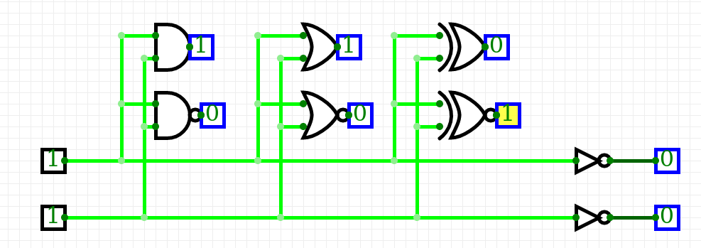
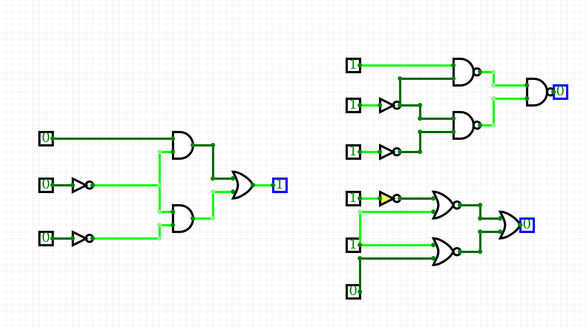
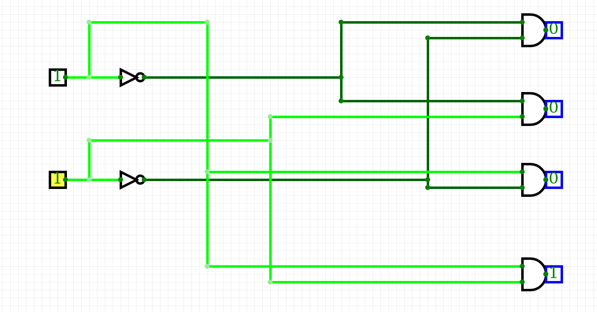

# Digital-electronics-1
## Boolean table
### 1. Ukol
|**A**|**NOT**|
|:-:|:-:|
|1|0|
|0|1|

| **A** | **B** | **AND** | **NAND** |
| :-: | :-: | :-: | :-: |
| 0 | 0 | 0 | 1 |
| 0 | 1 | 0 | 1 |
| 1 | 0 | 0 | 1 |
| 1 | 1 | 1 | 0 |

| **A** | **B** | **OR** | **NOR** |
| :-: | :-: | :-: | :-: |
| 0 | 0 | 0 | 1 |
| 0 | 1 | 1 | 0 |
| 1 | 0 | 1 | 0|
| 1 | 1 | 1 | 0 |

| **A** | **B** | **XOR** | **XNOR** |
| :-: | :-: | :-: | :-: |
| 0 | 0 | 0 | 1 |
| 0 | 1 | 1 | 0 |
| 1 | 0 | 1 | 0 |
| 1 | 1 | 0 | 1 |

### 2. ukol
| **A** | **B** |**C** |  |  |  |
| :-: | :-: | :-: | :-: | :-: | :-: |
| 0 | 0 | 0 | 1 | 1 | 1 |
| 0 | 0 | 1 | 0 | 0 | 0 |
| 0 | 1 | 0 | 0 | 0 | 0 |
| 0 | 1 | 1 | 0 | 0 | 0 |
| 1 | 0 | 0 | 1 | 1 | 1 |
| 1 | 0 | 1 | 1 | 1 | 1 |
| 1 | 1 | 0 | 0 | 0 | 0 |
| 1 | 1 | 1 | 0 | 0 | 0 |

### 3. ukol
| **A** | **B** | **Q3** | **Q2** | **Q1** | **Q0** |
| :-: | :-: | :-: | :-: | :-: | :-: |
| 0 | 0 | 0 | 0 | 0 | 1 |
| 0 | 1 | 0 | 0 | 1 | 0 |
| 1 | 0 | 0 | 1 | 0 | 0 |
| 1 | 1 | 1 | 0 | 0 | 0 |

## Created by:
* Filip Dušek
* Filip Jašek

## Command table
|**Command**|**Description**|
|:-:|:--|
|`Ctrl+Alt+T`|Open Linux terminal in Ubuntu based distributions|
|`Tab`|Automatic completion what you are typing or suggest options to you|
